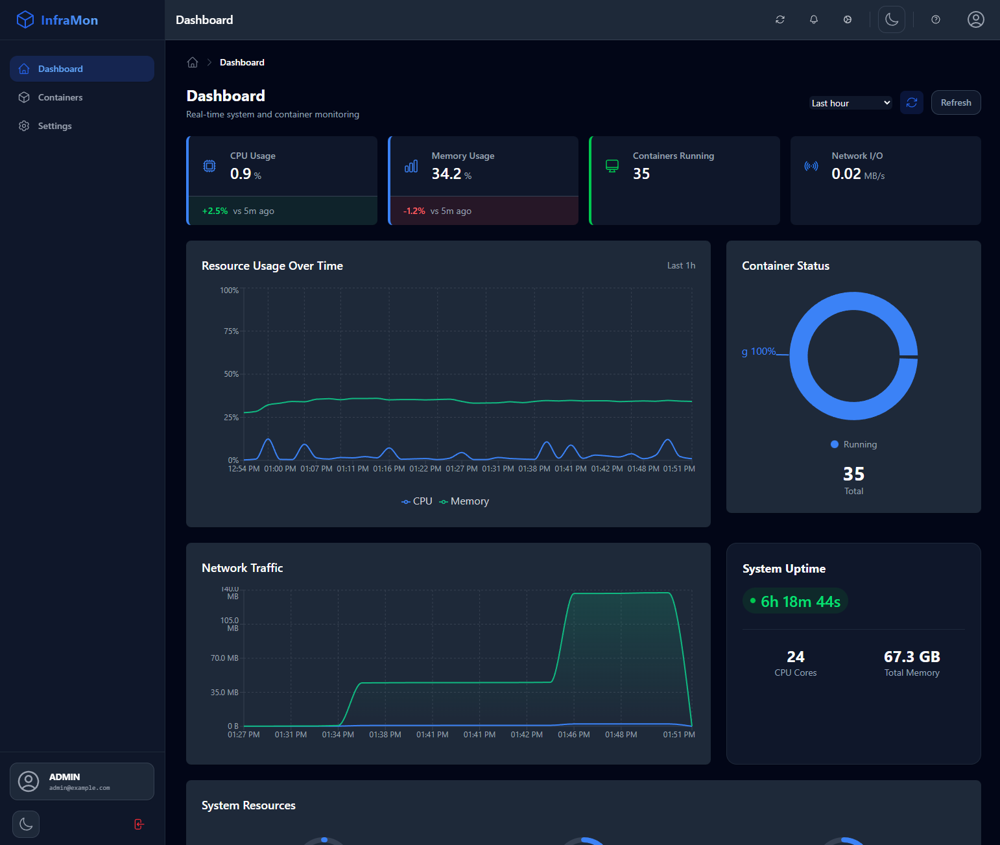
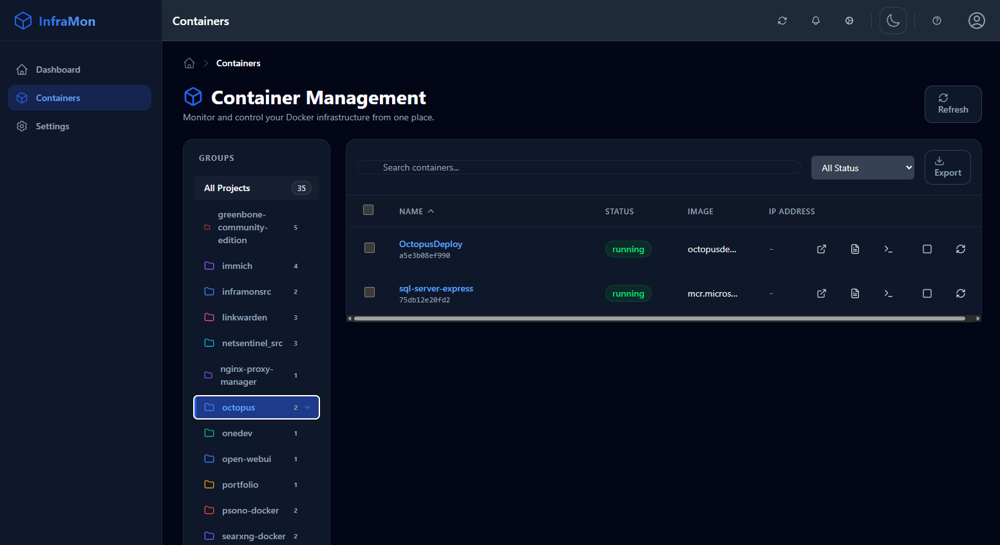
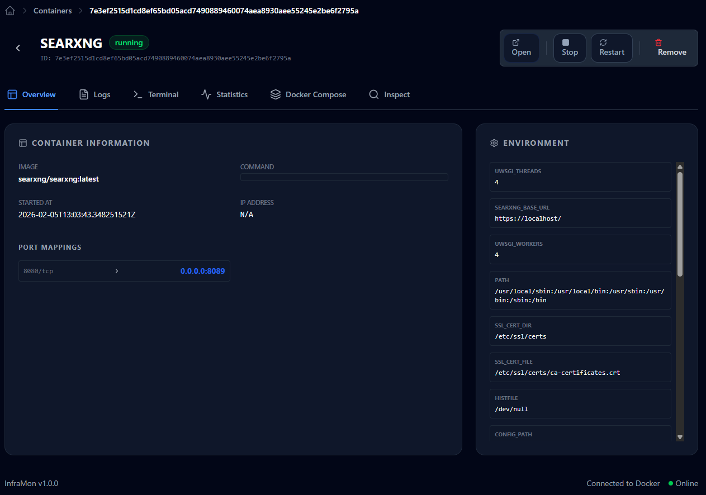
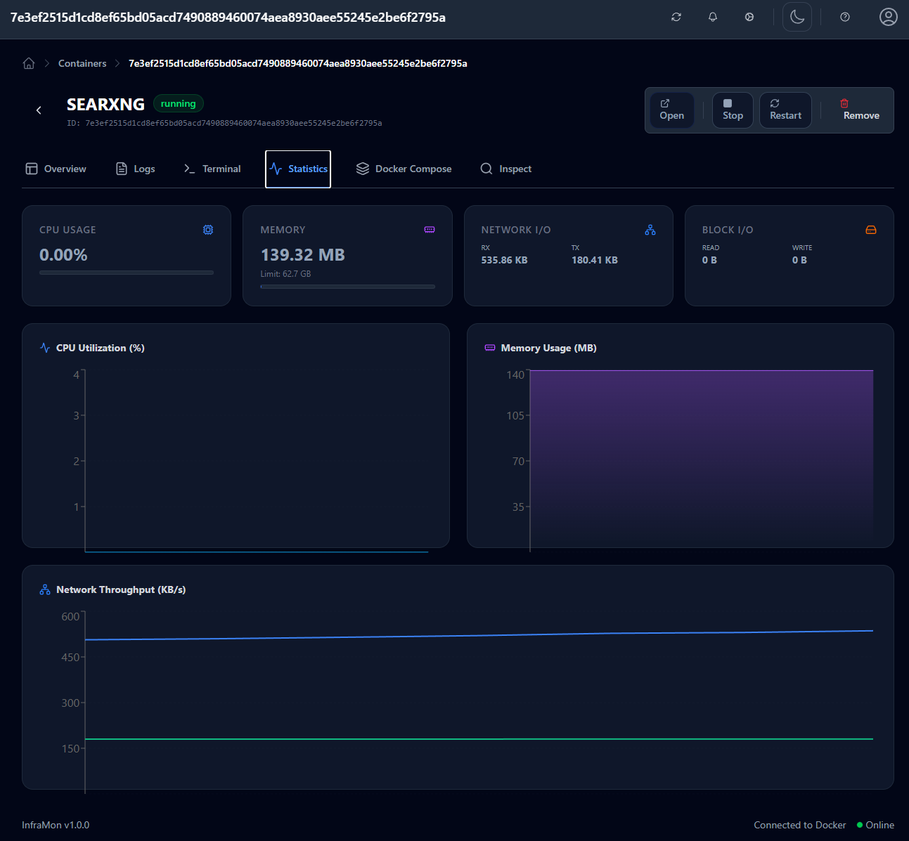
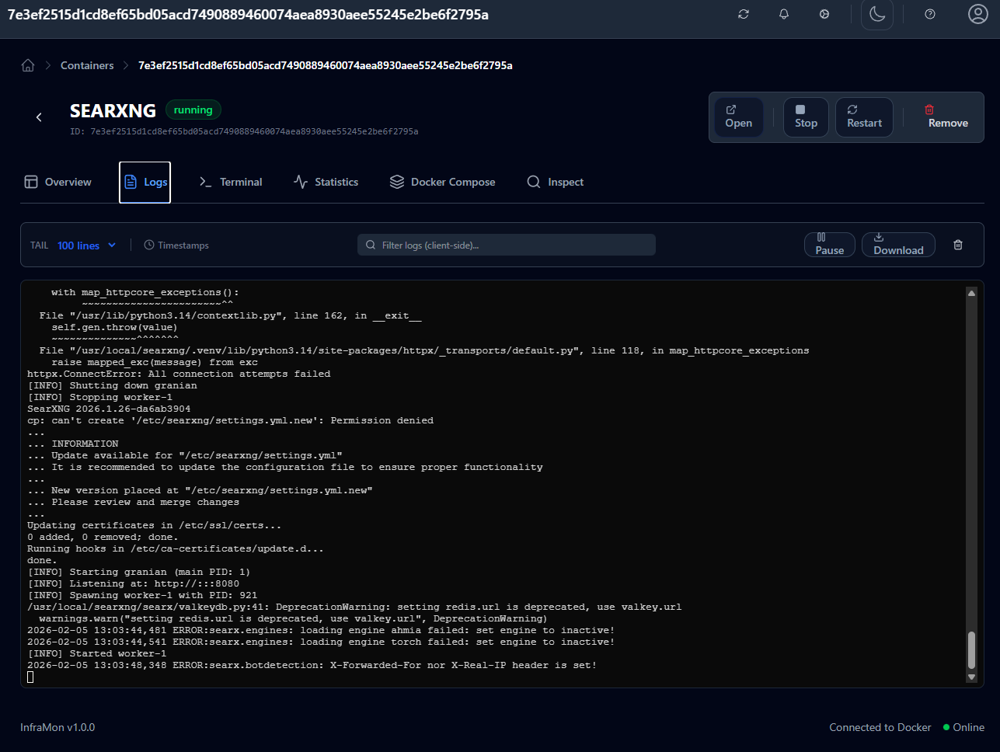

# InfraMon

**Docker Container Monitoring and Management System**



## Overview

InfraMon is a comprehensive infrastructure monitoring and management application designed to provide real-time visibility into Docker containerized environments. The application enables system administrators and DevOps engineers to monitor, manage, and analyze Docker containers running on host machines through an intuitive, modern web interface.

The system bridges the gap between container management and system monitoring, offering a seamless experience for controlling your container infrastructure.

## How It Was Built

InfraMon was developed using a modern, test-driven approach with comprehensive testing infrastructure at its core.

### Development Methodology

- **Test-Driven Development (TDD)**: Backend implemented with 30+ pytest tests covering API endpoints, authentication flows, and container operations
- **Component Testing**: Frontend built with Vitest and React Testing Library, featuring 32 passing tests for hooks, components, and page rendering
- **Mock-Based Testing**: Comprehensive mock implementations for Docker SDK, database operations, and API responses
- **CI-Ready Test Suite**: Test configuration ready for continuous integration with coverage reporting

### Development with AI

Built using AI-assisted development tools following a structured plan-based approach:
- **AntiGravity & Opencode**: AI coding agents for multi-step implementation tasks
- **MinMax M2.1 Free**: Primary language model for code generation and refactoring
- **Plan-Based Context**: All implementations follow the documented plan in docs/1_InfraMon_Plan.md with position tracking, ensuring consistent context throughout the development process
- **Context Preservation**: New AI agent sessions initiated after each key plan milestone, maintaining optimal context window usage while preserving implementation continuity

### Technology Stack

| Layer | Technology | Purpose |
|-------|------------|---------|
| **Frontend** | React 18 + TypeScript | UI components and state management |
| **Styling** | Tailwind CSS 4 | Responsive, accessible design system |
| **Frontend Testing** | Vitest + React Testing Library | Unit and integration tests |
| **Backend** | Python 3.11 + FastAPI | RESTful API with async support |
| **Database** | SQLite + Alembic | ORM-managed data persistence |
| **Backend Testing** | pytest + pytest-asyncio | Unit and integration tests |
| **Container Runtime** | Docker SDK for Python | Container management operations |
| **Virtualization** | Docker/Podman/Colima | Multi-runtime support |

### Key Development Features

- **Multi-Runtime Support**: Auto-detects Docker, Podman, or Colima sockets for flexible deployment
- **Hot Reloading**: Frontend with Vite HMR, backend with uvicorn reload
- **Type Safety**: Full TypeScript coverage on frontend, type hints on backend
- **Code Quality**: ESLint, Prettier, Black, isort, and mypy configured
- **Git History Sanitized**: Sensitive data removed from commit history

### Testing Infrastructure

```bash
# Backend tests (30+ tests, 80% coverage target)
cd backend && ./venv/bin/pytest tests/ -v

# Frontend tests (32 tests passing)
cd frontend && npm test

# VSCode Test Explorer
# Open Testing tab to browse and run tests
```

## Key Features

### 🚀 Real-time Container Monitoring
Display all Docker containers running on the host machine with their current state, resource utilization, and health status in real-time.

### 🔄 Container Lifecycle Management
Full control over your containers:
- **Start/Stop/Restart**: Manage container state directly from the UI.
- **Kill/Remove**: Forcefully stop or remove containers.
- **Pause/Unpause**: Temporarily freeze container processes.

### 🐳 Docker Compose Integration
- Automatically detects `docker-compose.yaml` files.
- Visualizes compose projects and services.
- Supports image updates via `docker compose pull`.

### 🔍 Deep Inspection & Shell Access
- **Comprehensive Inspection**: View full container configuration, network settings, volume mounts, and environment variables.
- **Web Terminal**: interactive shell access (`/bin/sh` or `/bin/bash`) directly in your browser via WebSocket.

### 📊 Resource Analytics
- **System Monitoring**: Track host machine resources including CPU, memory, disk usage, and network statistics.
- **Container Analytics**: Real-time charts for container-level resource consumption (CPU, Memory, Network I/O, Block I/O).

### 📝 Centralized Logging
- View real-time streaming logs for any container.
- Search, filter, and download logs.
- Support for ANSI colors and timestamp toggles.

### 🎨 Modern User Experience
- Responsive, accessible interface built with React and Tailwind CSS.
- **Dark/Light Mode**: Fully supported theme switching.
- **Group Management**: Organize containers into logical groups for easier management.

## Screenshots

### Container Management
Manage all your containers with advanced filtering and bulk actions.


### Detailed Inspection
Deep dive into container configuration and status.


### Real-time Statistics
Monitor resource usage with interactive charts.


### Live Logs
Stream and search container logs in real-time.


## Technical Architecture

The application follows a modern three-tier architecture:

- **Frontend**: React 18+ with TypeScript, Tailwind CSS 4, and React Router.
- **Backend**: Python FastAPI providing RESTful APIs with async/await support.
- **Database**: SQLite database managed through Alembic ORM.
- **Infrastructure**: Fully containerized with Docker and orchestrated via Docker Compose.

## Quick Start

### Prerequisites

- Docker Engine 24.0+
- Docker Compose v2.24+
- Git

### Installation

1. Clone the repository:
```bash
git clone https://github.com/pietermyb/InfraMon.git
cd InfraMon
```

2. Copy environment file:
```bash
cp .env.example .env
```

3. Configure environment variables in `.env`:
```bash
SECRET_KEY=your-super-secret-key
ADMIN_PASSWORD=your-strong-password
```

4. Start the application:
```bash
make up
```

5. Access the application:
- Web UI: http://localhost:3005
- API Docs: http://localhost:8065/api/docs

## Development

### Prerequisites

- Python 3.11+
- Node.js 20+
- npm or yarn

### Backend Development

```bash
# Create virtual environment
python -m venv venv
source venv/bin/activate

# Install dependencies
pip install -r backend/requirements.txt

# Start development server
make dev-backend
```

### Frontend Development

```bash
# Install dependencies
cd frontend
npm install

# Start development server
npm run dev
```

## Project Structure

```
InfraMon/
├── backend/              # FastAPI backend
│   ├── app/             # Application code
│   │   ├── api/        # API routes
│   │   ├── core/       # Configuration
│   │   ├── db/         # Database
│   │   ├── models/     # SQLAlchemy models
│   │   ├── schemas/    # Pydantic schemas
│   │   └── services/   # Business logic
│   ├── tests/          # Unit tests
│   └── alembic/        # Database migrations
├── frontend/            # React frontend
│   ├── src/            # Source code
│   │   ├── components/ # React components
│   │   ├── hooks/      # Custom hooks
│   │   ├── pages/      # Page components
│   │   └── services/   # API services
│   └── tests/          # Tests
├── docker/             # Docker configurations
└── docs/               # Documentation
```

## API Documentation

API documentation is available at `/api/docs` when running the backend server.

### Main Endpoints

- `GET /api/v1/containers` - List containers
- `POST /api/v1/containers/{id}/start` - Start container
- `POST /api/v1/containers/{id}/stop` - Stop container
- `POST /api/v1/containers/{id}/restart` - Restart container
- `GET /api/v1/containers/{id}/logs` - Get container logs
- `GET /api/v1/stats/dashboard` - Get dashboard statistics

## Testing

```bash
# Run all tests
make test

# Run backend tests
make test-backend

# Run frontend tests
make test-frontend
```

## Building for Production

```bash
make build
make up
```

## License

MIT License
