# InfraMon Architecture Documentation

**Document Version:** 1.0  
**Last Updated:** February 2026

---

## 1. System Overview

InfraMon is a full-stack Docker container monitoring and management application built with a modern, asynchronous architecture.

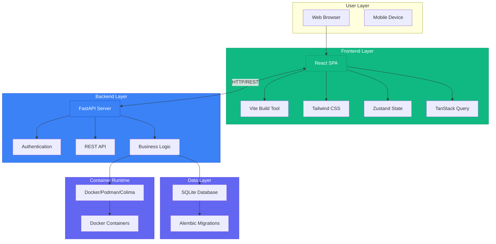

---

## 2. Backend Architecture

The backend follows a layered architecture pattern with clear separation of concerns.

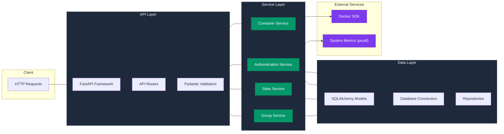

### Backend Directory Structure

```
backend/
├── app/
│   ├── api/v1/              # API endpoints
│   │   ├── auth.py          # Authentication endpoints
│   │   ├── containers.py    # Container management
│   │   ├── stats.py         # Statistics endpoints
│   │   ├── groups.py        # Container groups
│   │   └── users.py         # User management
│   ├── core/                # Core configuration
│   │   ├── config.py        # Settings
│   │   ├── security.py      # Security middleware
│   │   └── ...
│   ├── db/                   # Database layer
│   │   ├── database.py       # Database connection
│   │   └── ...
│   ├── models/              # SQLAlchemy models
│   │   ├── user.py
│   │   ├── container.py
│   │   └── container_group.py
│   ├── services/           # Business logic
│   │   ├── docker_service.py
│   │   ├── container_service.py
│   │   ├── stats_service.py
│   │   └── metrics_collector.py
│   └── main.py             # Application entry
├── tests/                  # Test suite
└── requirements.txt
```

---

## 3. Frontend Architecture

The frontend uses a component-based architecture with centralized state management.

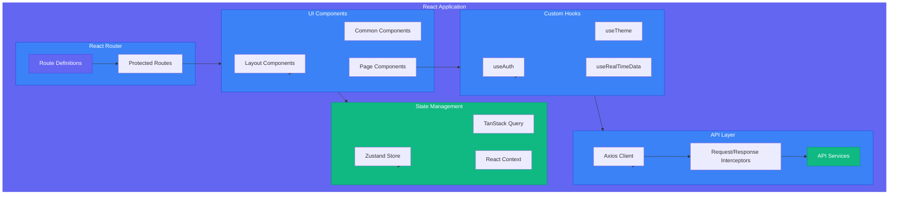

### Frontend Directory Structure

```
frontend/
├── src/
│   ├── api/                  # API definitions
│   │   └── endpoints.ts
│   ├── components/           # React components
│   │   ├── common/           # Shared components
│   │   │   ├── Button/
│   │   │   ├── Input/
│   │   │   ├── Modal/
│   │   │   └── ThemeToggle/
│   │   ├── layout/           # Layout components
│   │   │   ├── Sidebar/
│   │   │   ├── Header/
│   │   │   └── Layout/
│   │   └── pages/            # Page components
│   │       ├── Login/
│   │       ├── Dashboard/
│   │       ├── Containers/
│   │       └── Settings/
│   ├── hooks/                # Custom hooks
│   │   ├── useAuth.ts
│   │   ├── useTheme.ts
│   │   └── useRealTimeData.ts
│   ├── services/             # API services
│   │   └── api.ts
│   ├── store/                # State management
│   │   └── useStore.ts
│   ├── types/                # TypeScript types
│   │   └── index.ts
│   ├── utils/                # Utilities
│   │   └── helpers.ts
│   └── test/                 # Test setup
└── package.json
```

---

## 4. Data Flow

### Authentication Flow

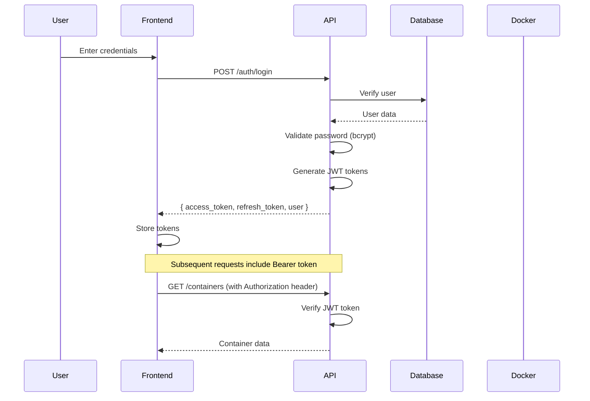

### Container Management Flow

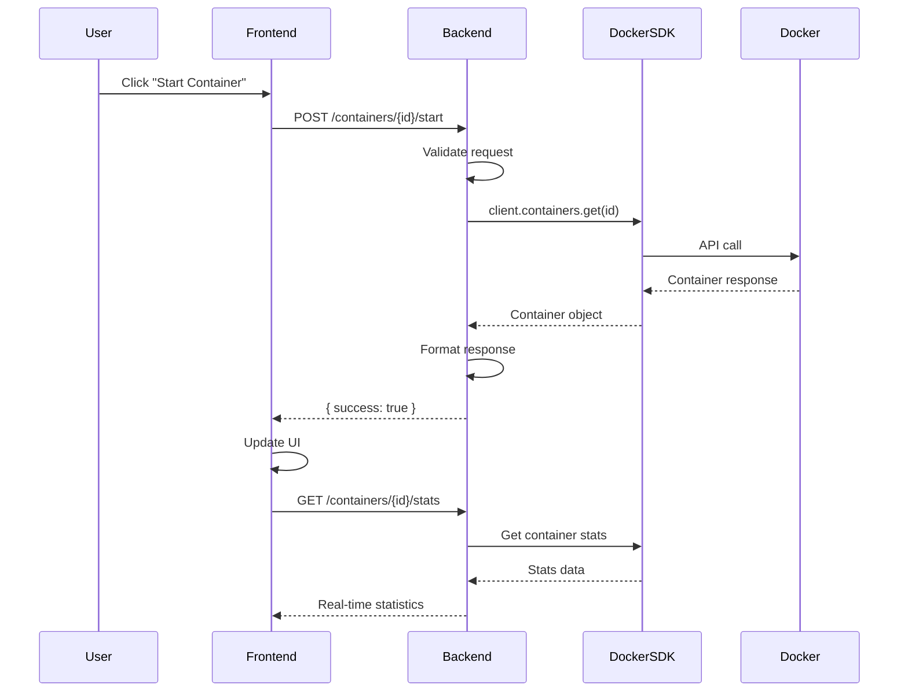

### Real-Time Data Flow

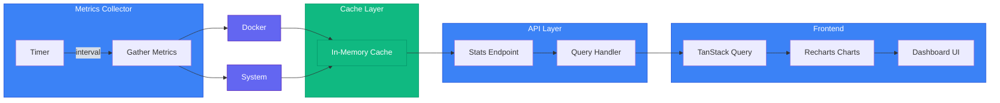

---

## 5. Database Schema

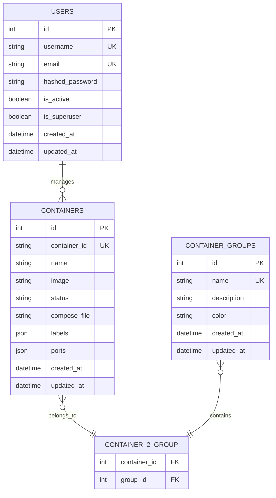

---

## 6. Deployment Architecture

### Development Environment

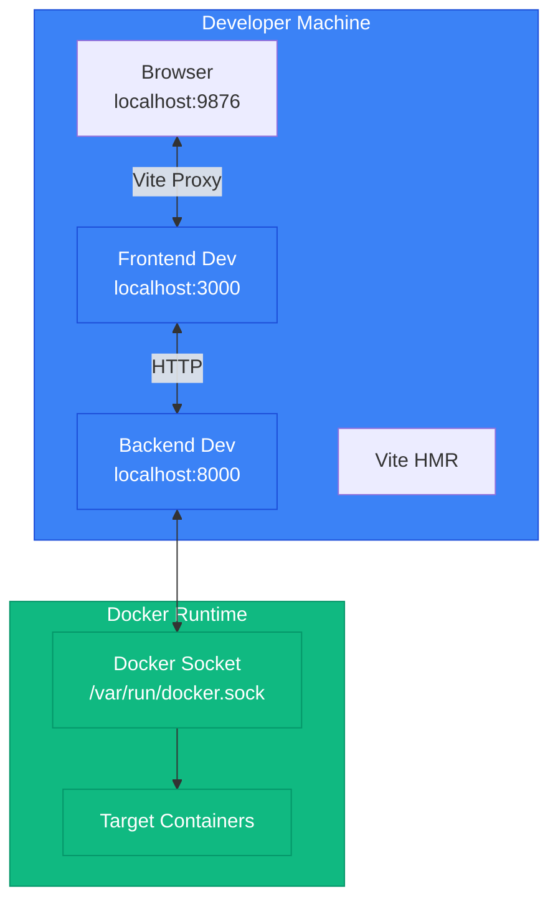

### Production Environment

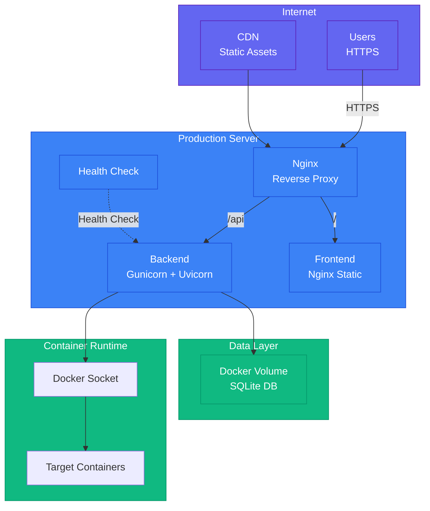

---

## 7. Security Architecture

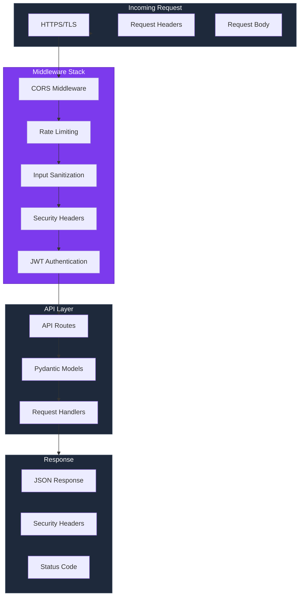

---

## 8. Technology Stack Summary

| Layer | Technology | Purpose |
|-------|------------|---------|
| **Frontend** | React 18 + TypeScript | UI framework |
| **Build Tool** | Vite 5 | Development & production build |
| **Styling** | Tailwind CSS 4 | Utility-first styling |
| **State** | Zustand 4 | Global client state |
| **Data Fetching** | TanStack Query 5 | Server state management |
| **Routing** | React Router 6 | Client-side routing |
| **HTTP Client** | Axios | HTTP requests |
| **Backend** | FastAPI + Python 3.11 | REST API framework |
| **Database** | SQLite + SQLAlchemy 2.0 | Data persistence |
| **ORM** | Alembic | Database migrations |
| **Container SDK** | Docker Python SDK | Container management |
| **Authentication** | python-jose + passlib | JWT + bcrypt |
| **Validation** | Pydantic 2 | Data validation |
| **Testing** | pytest + Vitest | Unit & integration tests |
| **CI/CD** | GitHub Actions | Automated pipeline |
| **Deployment** | Docker Compose | Container orchestration |

---

## 9. Key Design Decisions

### Why This Architecture?

1. **FastAPI + Async Python**
   - Native async support for concurrent container operations
   - Automatic API documentation (OpenAPI)
   - High performance (on par with Node.js)

2. **React + TypeScript**
   - Type safety across full stack
   - Large ecosystem and community
   - Excellent developer experience

3. **SQLite + SQLAlchemy**
   - Zero-configuration database
   - ACID compliance
   - Easy backups (single file)

4. **Docker SDK for Python**
   - Direct container management without CLI
   - Full Docker API access
   - Multi-runtime support (Docker/Podman/Colima)

5. **JWT Authentication**
   - Stateless sessions
   - Configurable expiration
   - Refresh token rotation

---

## 10. Performance Considerations

```mermaid
flowchart LR
    subgraph Optimizations["Optimization Strategies"]
        Caching["Request Caching\n(TanStack Query)"]
        Compression["Gzip Compression\n(Nginx)"]
        Chunking["Code Splitting\n(Vite)"]
        Polling["Smart Polling\n(5s interval)"]
        Debouncing["Debounced Inputs\n(User actions)"]
    end

    subgraph Metrics["Performance Metrics"]
        FCP["First Contentful Paint\n< 1s"]
        LCP["Largest Contentful Paint\n< 2.5s"]
        TTFB["Time to First Byte\n< 200ms"]
        TTI["Time to Interactive\n< 3s"]
    end

    Optimizations --> Metrics

    classDef opt fill:#3b82f6,stroke:#1d4ed8,color:#fff
    classDef metric fill:#10b981,stroke:#059669,color:#fff

    class Optimizations opt
    class Metrics metric
```

---

*Document generated for InfraMon v0.1.0*
